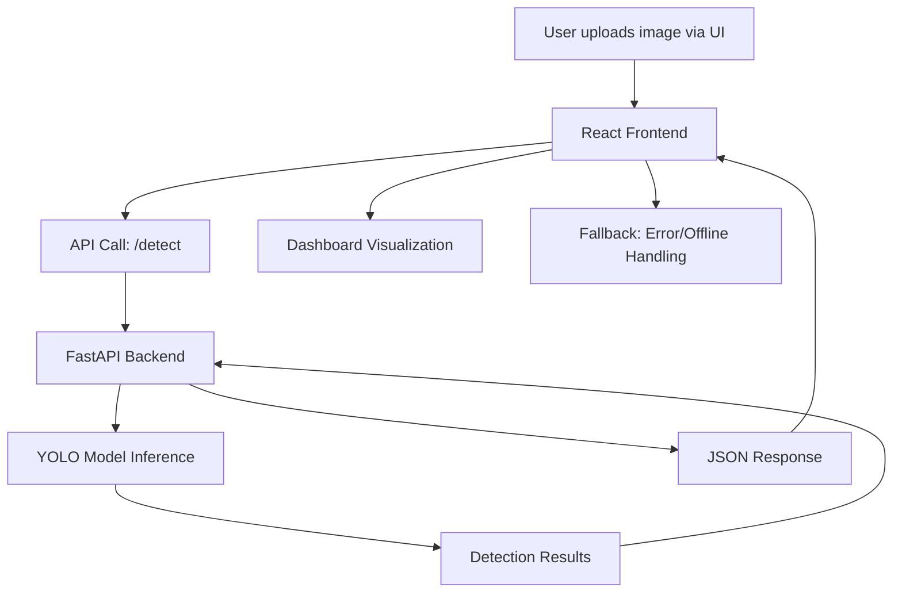

# Retro Scan AI


## 🚦 Project Overview
Retro Scan AI is a production-ready platform for automated road asset detection, scoring, and analytics. It leverages state-of-the-art YOLO models and a modern web dashboard to deliver actionable insights for infrastructure maintenance and compliance.

**Key Benefits:**
- Automated detection of road signs, markings, and studs
- Real-time scoring and compliance analytics
- Intuitive dashboard for visualization and reporting
- Robust fallback and error handling for seamless user experience

---

## 🏗️ Architecture



---

## 📁 Project Structure

```
Retro Scan AI/
├── backend/           # FastAPI backend and YOLO logic
│   ├── app.py         # Main FastAPI app
│   ├── requirements.txt
│   └── ...
├── src/               # React frontend source code
│   ├── api/
│   ├── components/
│   ├── pages/
│   └── ...
├── public/            # Static assets
├── package.json       # Frontend dependencies
└── ...
```

---

## 🚀 Quickstart

### Prerequisites
- Python 3.10+
- Node.js 18+
- (Recommended) [Git](https://git-scm.com/)

### Backend Setup
```sh
cd backend
python -m venv .venv
# On Windows:
.venv\Scripts\activate
# On macOS/Linux:
source .venv/bin/activate
pip install -r requirements.txt
uvicorn app:app --reload --host 127.0.0.1 --port 8000
```

### Frontend Setup
```sh
npm install
npm run dev
# Open http://localhost:5173 in your browser
```

---

## 🧑‍💻 Usage

### API Example
**Detect objects in an image:**

```bash
curl -X POST "http://127.0.0.1:8000/detect" -F "file=@test.jpg" -F "speed=80"
```

**Health check:**
```bash
curl http://127.0.0.1:8000/health
```

### UI Example
1. Open the dashboard in your browser.
2. Upload a road asset image.
3. View detection results, compliance status, and analytics.

---

## 🔌 API Endpoints

- `GET /health` — Health check
- `POST /detect` — Run YOLO detection on an uploaded image

---

## ⚙️ Configuration

- **YOLO Model:** The backend uses [Ultralytics YOLO](https://github.com/ultralytics/ultralytics). Default: `yolov8n.pt`.
- **Custom Model:** Set the `YOLO_MODEL` environment variable to use a different model.

---

## 🛠️ Troubleshooting

- **Backend not found?** Ensure the FastAPI server is running at `http://127.0.0.1:8000`.
- **Module errors?** Double-check your Python environment and installed dependencies.
- **YOLO errors?** Make sure the model file exists and is compatible with your Ultralytics version.
- **CORS issues?** The backend enables CORS for all origins by default.

---

## 🤝 Contributing

Contributions are welcome! To contribute:
1. Fork the repository
2. Create a new branch (`git checkout -b feature/your-feature`)
3. Commit your changes
4. Push to your fork and open a Pull Request

Please see [CONTRIBUTING.md](CONTRIBUTING.md) for guidelines.

---

## ❓ FAQ

**Q: Can I use a custom YOLO model?**  
A: Yes, set the `YOLO_MODEL` environment variable to your model path.

**Q: How do I deploy this in production?**  
A: Use a production server (e.g., Gunicorn with Uvicorn workers) and serve the frontend with a static file server or CDN.

**Q: Where do I report bugs?**  
A: Please open an issue on GitHub.

---

## 📄 License

This project is licensed under the MIT License.

---

## 👤 Authors & Maintainers

- [Your Name] — Project Lead
- [Contributors]

---
For questions or support, please open an issue or contact the maintainer.
